To build:

```bash
DOCKER_BUILDKIT=1 \
docker build .
```

To build locally:

```bash
./gradlew build
```

The output will be in `build/goos`.

To run the end-to-end tests:

```bash
COMPOSE_DOCKER_CLI_BUILD=1 DOCKER_BUILDKIT=1 \
GOOS_TAG=latest \
docker-compose \
 -f end-to-end-tests/docker-compose.yml \
 up \
 --build \
 --exit-code-from end-to-end-tests --abort-on-container-exit
```

To run the end-to-end tests locally:

* Install dnsmasq: `brew install dnsmasq`
* Ensure it resolves *.internal to localhost:
  ```bash
  echo address=/internal/127.0.0.1 >> /usr/local/etc/dnsmasq.conf
  echo 'nameserver 127.0.0.1' | sudo tee /etc/resolver/internal > /dev/null
  sudo dscacheutil -flushcache
  sudo killall -HUP mDNSResponder
  ping -c1 foo.internal
* Run up the required docker containers:
  ```bash
  DOCKER_BUILDKIT=1 docker build -t goos-instrumentedapp . && docker run -p 1234:1234 goos-instrumentedapp
  cd docker-openfire && docker build -t openfire . && docker run -p 5222:5222 -p 9090:9090 -h auctionhost.internal openfire
  ```

You should now be able to run the tests locally.

## Architecture

The basic architecture is ports-and-adapters, or hexagonal. The core logic is I/O free, and
interacts with the world via ports, fulfilled by injected adapters.

Each port should have a stub that runs in memory. It should also have a set of contract tests that
can be run against any adapter implementation of the port, including the stub.

### Module structure

The app has the following modules:

- `app`  
  The app module contains the main method that:
    - instantiates the desired adapters for the ports the core depends on
    - instantiates the core domain passing it the adapters
    - runs the core logic
- `core`  
  The core module contains the domain logic of the app. It does no I/O; instead it depends on ports
  that do all the I/O. These are passed in when the core logic is instantiated - this module is not
  responsible for instantiating them and has no knowledge of the specific adapter implementation it
  runs against.
- multiple ports, of the form:
    - `{port}/api`
        - `src`
          Defines the interface(s) and data classes (logic free structs or DTOs) that make up the
          API of a port
        - `testFixtures`
          Defines:
            - abstract contract tests for the API. They accept an instance of the port (interface),
              and so can be implemented for any adapter by injecting an instance of that adapter
              into them. They are written using:
            - an interface describing a driver for the API. An implementation of this will allow
              interacting with the API in ways the core application does not need to in order to
              facilitate testing. For instance, the UI driver will allow interaction with the UI
              from the user's perspective.
    - `{port}/stub`
        - `src`
          This is a purely in-memory, fake implementation of the port. It allows any tests of code
          that needs to interact with this port to run very fast, without doing any I/O.
        - `testFixtures`
          This contains a stub implementation of the port driver defined
          in `{port}/api/testFixtures`. It allows any tests that need to interact with this port to
          run very fast, without doing any I/O.
        - `tests`
          This contains an implementation of the contract tests defined in `{port}/api/testFixtures`
          , proving that the stub implementation fulfils that contract.
    - `{port}/{adapter}`
        - `src`
          This is a working implementation of the port defined in `{port}/api/src`
        - `testFixtures`
          This contains a working implementation of the port driver defined in
          `{port}/api/testFixtures`. It allows any tests that need to interact with this port to do
          so.
        - `tests`
          This contains an implementation of the contract test defined in `{port}/api/testFixtures`,
          proving that the adapter implementation fulfils that contract.

          This is an odd one - it's highly likely to involve I/O, so the contract tests in here
          should *not* run as part of the basic build. They should be run as specific extra steps.
- `end-to-end-tests`
    - `src`
      Defines abstract contract tests for the whole application. These interact with the various
      ports using the drivers defined in `{port}/api/testFixtures`. Implementations are responsible
      for initialising the app with the corresponding adapters and starting it.
    - `tests`
      This contains an implementation of the abstract contract tests defined in
      `end-to-end-tests/src` constructing the app with the adapters defined in `{port}/stub/src`
      and the tests with the drivers defined in `{port}/stub/testFixtures` that can be run as part
      of the main build. There would typically be at least two implementations:
        - a real one, constructing the app with the adapters defined in `{port}/{adapter}/src` and
          the tests with the drivers defined in `{port}/{adapter}/testFixtures`

Diagram key:

- Circular elements are interfaces - they contain no logic, only declare interfaces and data classes
- Solid line means `a` constructs `b` if `b` is a component or depends on `b` if `b` is an
  interface.
- Dashed line mean `a` implements `b`.
- Top level components are executable. The only logic they contain is the choice of components to
  instantiate and wire together.
- All other components contain the actual logic

#### Adapter contract testing component diagram

The principles here are:
* by running the same contract tests against both the actual implementations and the stub, we create
  confidence that the stub is an accurate representation of the actual implementation
* by having contract tests we make it easy to replace an implementation - to migrate from Swing to
  JFX, or from an XMPP based interaction with the Auction server to some other API

```plantuml
@startuml
!pragma layout smetana

node production { 
    component app
    component core
    interface auction
    component auction.xmpp
    interface ui
    component ui.swing
}

node "UI Contract tests" {
    component "ui-contract-test" as ui_contract_test
    interface "ui-test-driver" as ui_test_driver
    
    node "UI Stubbed" {
        component "stub-ui-contract-test" as stub_ui_contract_test
        component "stub-ui" as stub_ui
        component "stub-ui-test-driver" as stub_ui_test_driver
    }
    
    node "UI Actual" {
        component "ui.swing-contract-test" as ui.swing_contract_test
        component "ui.swing-test-driver" as ui.swing_test_driver
    }
}

node "Auction Contract tests" {
    component "auction-contract-test" as auction_contract_test
    interface "auction-test-driver" as auction_test_driver
    
    node "Auction Stubbed" {
        component "stub-auction-contract-test" as stub_auction_contract_test
        component "stub-auction" as stub_auction
        component "stub-auction-test-driver" as stub_auction_test_driver
    }
    
    node "Auction Actual" {
        component "auction.xmpp-contract-test" as auction.xmpp_contract_test
        component "auction.xmpp-test-driver" as auction.xmpp_test_driver
    }
}

app --> core
core --> ui
app --> ui.swing
ui.swing ..> ui

core --> auction
app --> auction.xmpp
auction.xmpp ..> auction

stub_ui ..> ui
ui.swing_test_driver ..> ui_test_driver
stub_ui_test_driver ..> ui_test_driver

stub_auction ..> auction
auction.xmpp_test_driver ..> auction_test_driver
stub_auction_test_driver ..> auction_test_driver

ui_contract_test --> ui
ui_contract_test --> ui_test_driver

ui.swing_contract_test --> ui_contract_test
ui.swing_contract_test --> ui.swing_test_driver
ui.swing_contract_test --> ui.swing

stub_ui_contract_test --> ui_contract_test
stub_ui_contract_test --> stub_ui_test_driver
stub_ui_contract_test --> stub_ui

auction_contract_test --> auction
auction_contract_test --> auction_test_driver

stub_auction_contract_test --> auction_contract_test
stub_auction_contract_test --> stub_auction_test_driver
stub_auction_contract_test --> stub_auction

auction.xmpp_contract_test --> auction_contract_test
auction.xmpp_contract_test --> auction.xmpp_test_driver
auction.xmpp_contract_test --> auction.xmpp

@enduml
```



#### End to end test component diagram

The principles here are:
* the stubbed tests instantiate `core` passing it the stubbed implementations that were proven in
  the adapter contract tests above, and interact with the resulting app using the stub test driver
  implementations that were likewise proven in the adapter contract tests above
* this gives confidence that if the stubbed end-to-end tests pass, the same tests would pass against
  the real app
* the same tests can be run against the real app, instantiated by the `end-to-end-real-tests` and
  interacting with it via the test drivers proven in the adapter contract tests above

```plantuml
@startuml
!pragma layout smetana

node production { 
    component app
    component core
    interface auction
    component auction.xmpp
    interface ui
    component ui.swing
}

node Contract {
    interface "ui-test-driver" as ui_test_driver
    interface "auction-test-driver" as auction_test_driver
    component "end-to-end-contract-test" as end_to_end_contract_test
}

node "Stubbed end-to-end tests" {
    component "end-to-end-stubbed-tests" as end_to_end_stubbed_tests
    component "stub-ui" as stub_ui
    component "stub-auction" as stub_auction
    component "stub-ui-test-driver" as stub_ui_test_driver
    component "stub-auction-test-driver" as stub_auction_test_driver
}

node "Real end-to-end tests" {
    component "end-to-end-real-tests" as end_to_end_real_tests
    component "ui.swing-test-driver" as ui.swing_test_driver
    component "auction.xmpp-test-driver" as auction.xmpp_test_driver
}

app --> core
core --> ui
app --> ui.swing
ui.swing ..> ui

core --> auction
app --> auction.xmpp
auction.xmpp ..> auction

stub_ui ..> ui
ui.swing_test_driver ..> ui_test_driver
stub_ui_test_driver ..> ui_test_driver

stub_auction ..> auction
auction.xmpp_test_driver ..> auction_test_driver
stub_auction_test_driver ..> auction_test_driver

end_to_end_contract_test --> ui_test_driver
end_to_end_contract_test --> auction_test_driver

end_to_end_real_tests -> app
end_to_end_real_tests --> end_to_end_contract_test
end_to_end_real_tests --> ui.swing_test_driver
end_to_end_real_tests --> auction.xmpp_test_driver

end_to_end_stubbed_tests --> end_to_end_contract_test
end_to_end_stubbed_tests --> stub_ui_test_driver
end_to_end_stubbed_tests --> stub_auction_test_driver
end_to_end_stubbed_tests --> core
end_to_end_stubbed_tests --> stub_ui
end_to_end_stubbed_tests --> stub_auction

@enduml
```


